# HTML的表单与CSS样式

## 学习目标

1. 能够使用表单form标签创建表单容器
2. 能够使用表单中常用的input标签创建输入项
3. 能够使用表单select标签定义下拉选择输入项
4. 能够使用表单textarea标签定义文本域
5. 能够使用CSS的基本选择器选择元素
6. 能够使用CSS的扩展选择器选择元素
7. 能够使用常见的CSS属性
8. 能够说出盒子模型的属性
9. 能够制作黑马旅游网的注册页面

# 第1章 表单

## 1.1 表单标签

### 1.1.1 表单标签作用

​	用于将客户端浏览器的数据提交给服务器，一切需要提交数据的场景都会使用到表单。表单标签名字：form，注意与from区别。表单在网页上不可见，只是一个容器来存放表单项。

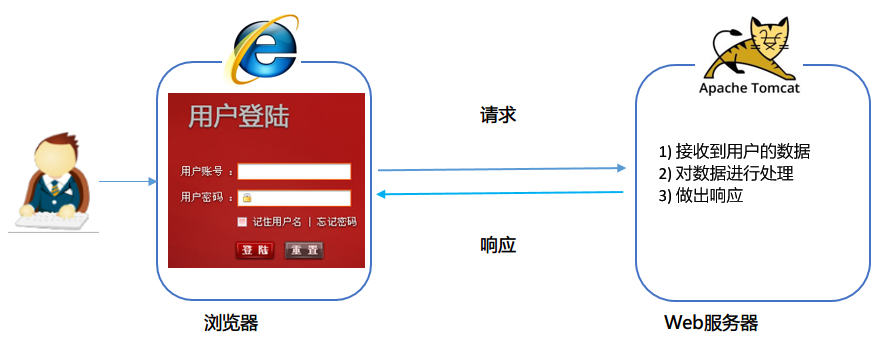

### 1.1.2 常用的属性

| **常用属性**   | **作用**                           |
| ---------- | -------------------------------- |
| **action** | 数据提交给服务器的地址，如果没有这个属性，默认提交给自己。    |
| **method** | 提交的方式，有2种提交方式：get或post，默认是get方式。 |

### 1.1.3 GET与POST在格式上的区别


| **提交方法** | **特点**                                   |
| -------- | ---------------------------------------- |
| **GET**  | 数据会出现在地址栏的后面以?分隔，?前面是地址，后面是参数  如果是多个参数，参数之间使用&分隔 |
| **POST** | 提交的参数不会显示在地址栏上，相对更加安全。                   |

## 1.2 表单中的控件

### 1.2.1 表单组件的认识

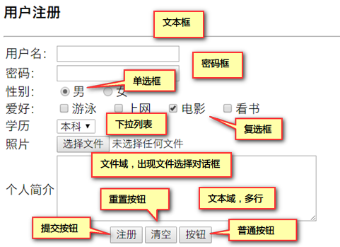

### 1.2.2 input标签type的属性值

| **值**          | **描述**                             |
| -------------- | ---------------------------------- |
| button         | 定义可点击的按钮（大多与 JavaScript 使用来启动脚本）   |
| checkbox       | 定义复选框。                             |
| color          | 定义拾色器。                             |
| date           | 定义日期字段（带有 calendar 控件）             |
| datetime       | 定义日期字段（带有 calendar 和 time 控件）      |
| datetime-local | 定义日期字段（带有 calendar 和 time 控件）      |
| month          | 定义日期字段的月（带有 calendar 控件）           |
| week           | 定义日期字段的周（带有 calendar 控件）           |
| time           | 定义日期字段的时、分、秒（带有 time 控件）           |
| email          | 定义用于 e-mail 地址的文本字段                |
| file           | 定义输入字段和 "浏览..." 按钮，供文件上传           |
| hidden         | 定义隐藏输入字段                           |
| image          | 定义图像作为提交按钮                         |
| number         | 定义带有 spinner 控件的数字字段               |
| password       | 定义密码字段。字段中的字符会被遮蔽。                 |
| radio          | 定义单选按钮。                            |
| range          | 定义带有 slider 控件的数字字段。               |
| reset          | 定义重置按钮。重置按钮会将所有表单字段重置为初始值。         |
| search         | 定义用于搜索的文本字段。                       |
| submit         | 定义提交按钮。提交按钮向服务器发送数据。               |
| tel            | 定义用于电话号码的文本字段。                     |
| text           | 默认。定义单行输入字段，用户可在其中输入文本。默认是 20 个字符。 |
| url            | 定义用于 URL 的文本字段。                    |

## 1.3 案例：表单标签的使用

#### 案例需求

​	结合表格布局，制作如图所示的注册页面。

#### 案例效果

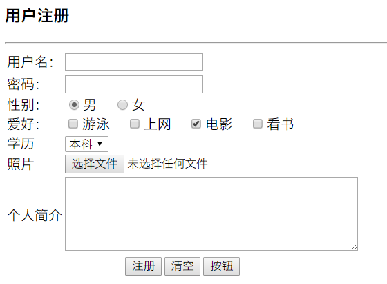

#### 案例分析

1. 整个表单由8行2列组成，第1列显示文本，可以在td中使用label标签
2. 用户名、密码、性别、爱好、照片使用input标签，设置不同的type属性
3. 学历使用select，个人简介使用textarea
4. 最后1行跨2列，注册、清空、按钮的type分别是submit、reset、button

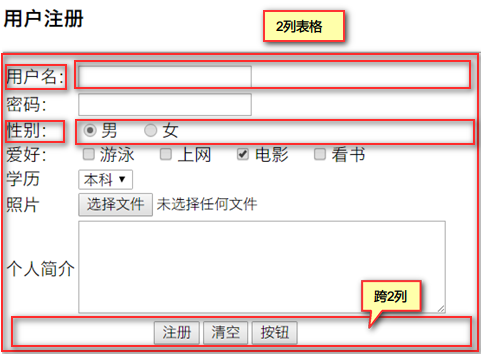

#### 案例代码

```html
<!DOCTYPE html>
<html>
<head>
<meta charset="UTF-8">
<title>用户注册</title>
</head>
<body>
<h3>用户注册</h3>
<form action="server" method="get">
<!--隐藏表单项-->
<input type="hidden" name="id" value="29347923742"/>
<table>
    <tr>
        <td>用户名：</td>
        <!--文本框-->
        <td><input name="user" type="text" value="孙悟空"/></td>
    </tr>
    <tr>
        <td>密码：</td>
        <!--密码框-->
        <td><input name="pwd" type="password"/></td>
    </tr>
    <tr>
        <td>性别：</td>
        <td>
            <!--单选框-->
            <input type="radio" name="gender" value="男" checked="checked"/>男
            <input type="radio" name="gender" value="女"/>女
        </td>
    </tr>
    <tr>
        <!--复选框-->
        <td>爱好：</td>
        <td>
            <input type="checkbox" name="hobby" value="游泳" checked="checked"/>游泳
            <input type="checkbox" name="hobby" value="上网"/>上网
            <input type="checkbox" name="hobby" value="上吊"/>上吊
            <input type="checkbox" name="hobby" value="上学" checked="checked"/>上学
        </td>
    </tr>
    <tr>
        <td>学历：</td>
        <td>
            <!--下拉列表-->
            <select name="edu" multiple="multiple" size="3">
                <option value="1">高中</option>
                <option value="2">大专</option>
                <option value="3" selected="selected">本科</option>
                <option value="4">硕士</option>
                <option value="5">烈士</option>
                <option value="6">圣斗士</option>
            </select>
        </td>
    </tr>
    <tr>
        <td>
            照片：
        </td>
        <td>
            <!--文件选择框-->
            <input type="file" name="photo" accept="image/*"/>
        </td>
    </tr>
    <tr>
        <td>
            个人简介：
        </td>
        <td>
            <!--文本域-->
            <textarea name="intro" rows="5" cols="50"></textarea>
        </td>
    </tr>

    <tr>
        <td colspan="2" align="center">
            <!--不同类型的按钮-->
            <input type="submit" value="注册"/>
            <input type="reset" value="重置"/>
            <input type="button" value="普通按钮"/>
            <button>我也是按钮</button>
            <input type="image" src="img/regbtn.jpg"/>
        </td>
    </tr>
</table>
</form>
</body>
</html>
```


# 第2章 CSS选择器

## 2.1 CSS概述

### 2.1.1 为什么要CSS

​	什么是CSS：Cascading Style Sheet 层叠样式表，专门用于网页的美化。

#### 案例需求：

​	将一个表格中所有的单元格居中，如果使用以前的方式，每个td或tr都要设置align属性为center，而使用css则方便得多。

#### 案例效果：

	

#### 案例代码：

```html
<!DOCTYPE html>
<html>
<head>
    <meta charset="utf-8"/>
    <title></title>
    <!--使用css样式功能更加强大-->
    <style type="text/css">
        /*选择器*/
        td {
            /*文本居中对齐*/
            text-align: center;
            color: blue;
        }
    </style>
</head>
<body>
<table border="1" width="500">
    <tr>
        <td>100</td>
        <td>200</td>
        <td>300</td>
    </tr>
    <tr>
        <td>400</td>
        <td>555</td>
        <td>666</td>
    </tr>
    <tr>
        <td>777</td>
        <td>888</td>
        <td>999</td>
    </tr>
</table>
</body>
</html>
```

### 2.1.2 CSS美化的好处

| **CSS的好处** | 描述                                      |
| ---------- | --------------------------------------- |
| **功能上更强**  | 比HTML美化的功能更加强大，可以实现HTML不能实现的功能。如：给H2加颜色 |
| **降低耦合度**  | 分工更加明确，CSS专门用于美化，HTML专门用于结构搭建           |

### 2.1.3 CSS的编写规范

| **规范**   | **说明**                  |
| -------- | ----------------------- |
| **大括号**  | 所有的样式都写在大括号内部           |
| **样式名**  | 全部字母小写，如果多个单词使用-分隔      |
| **样式值**  | 所有样式名样式值是固定的,名字与值之间使用冒号 |
| **样式结尾** | 每个样式使用分号结尾              |
| **注释**   | /* 注释 */ 类似于Java中的多行注释  |

## 2.2 CSS的位置

### 2.2.1 行内样式

只对某一行起作用

```html
<div style="color: green">世界多么美好</div>
```

### 2.2.2 内部样式

出现在HTML内部的样式

```html
<style type="text/css">
p {
 color: gray;
}
</style>
```

### 2.2.3 外部样式

把CSS文件放在HTML的外部，使用的时候需要引入进来才可以使用

#### 1. 引入方式一(掌握)：

```html
<link type="text/css" rel="stylesheet" href="css/out.css"/>
```

- type: 指定文本的类型
- rel: 指定当前的HTML与CSS文件之间的关系 relation
- href: 指定样式文件地址

#### 2. 引入方式二(了解)：

import指令导入。其中： url函数，指定文件名

```html
<style type="text/css">
	@import url("css/out.css");
</style>
```

#### 3. 优先级： 

​	就近原则，后面的同名样式会覆盖前面的样式

## 2.3 基本选择器

### 2.3.1 选择器的作用

​	用来选择要操作的元素或标签

### 2.3.2 语法格式

```
选择器 {
	样式名: 样式值;
}
```

### 2.3.3 三种基本选择器

| **选择器分类** | **作用**          | **语法**    | **细节**                                   |
| --------- | --------------- | --------- | ---------------------------------------- |
| **标签选择器** | 通过标签名选择同名的所有的标签 | 标签 {  }   |                                          |
| **类选择器**  | 通过class属性的值选择元素 | .类名 {  }  | 前提：先给标签进行分类  使用class属性分类  <br />类名：不能以数字开头 |
| **ID选择器** | 通过属性ID选择元素      | \#ID {  } | 前提：先给标签指定ID属性  <br />唯一：建议ID在同个网页中唯一，不要重复 |

### 2.3.4 优先级

​	**标签选择器 < 类选择器 < ID选择器**

### 2.3.5 演示代码

#### 案例需求

​	通过代码演示上面CSS的导入，各种基本选择器的使用

#### 案例效果


#### 案例代码

```html
<!DOCTYPE html>
<html>
<head>
	<meta charset="UTF-8">
	<title></title>
	<!--引入外部样式-->
	<!--方式一：使用link标签-->
	<!--<link type="text/css" rel="stylesheet" href="css/out.css"/>-->
	
	<!--方式二：import指令导入。其中： url函数，指定文件名-->
	<style type="text/css">
		@import url("css/out.css");
	</style>
	<style type="text/css">
		p {
			color: gray;
		}
		
		#three {
			font-size: 60px;
		}
	
		.hello {
			font-size: 50px;
		}
		
		/*标签选择器*/
		div {
			font-size: 40px;
		}
		
		/*类选择器*/
		.one {
			color: blue;
		}
		
		/*id选择器*/
		#two {
			font-family: 楷体;
		}
	</style>
</head>
<body>
	<div style="color: green">世界多么美好</div>
	<div >世界多么美好</div>
	<p>今天空气有雾霾</p>
	<p style="color: red">今天空气不错</p>
	<h2>我是标题</h2>
	<h2 id="two">我是标题</h2>
	
	<h1 class="one">我是一类</h1>
	<div class="one">我也是一类</div>
	
	<div id="three" class="hello">
		我三个都有
	</div>
</body>
</html>
```

## 2.4 扩展选择器

### 2.4.1 什么是扩展选择器

​	是基本选择器的组合，选择更加灵活，选择方式更加多样。

### 2.4.2 常用的扩展选择器

| **扩展选择器** | **格式**                                   | **作用**                                   | **语法符号** |
| --------- | ---------------------------------------- | ---------------------------------------- | -------- |
| **层级选择器** | 父选择器  子孙选择器{  }                          | 选择父元素下所有的子孙元素                            | 空格       |
| **属性选择器** | 标签名[属性名]  <br />标签名[属性名="属性值"]           | 只要包含属性名就被选中  <br />某个属性名=属性值的元素选中        | [ ] 中括号  |
| **伪类选择器** | 链接：  <br />a:link 正常状态  <br />a:visited 访问过的  <br />a:hover 鼠标悬停  <br />a:active 正在激活  <br />文本框：  <br />:focus 得到焦点 | 同一个元素在不同的操作状态下呈现不同的样式              <br />文本框如果有光标在中间，表示得到焦点 | :  冒号    |
| **并集选择器** | 选择器1,选择器2                                | 多个选择器的集合                                 | , 逗号     |

### 2.4.3 扩展选择器案例演示

#### 案例需求

​	通过一个小例子，学习扩展选择器的使用

#### 案例效果

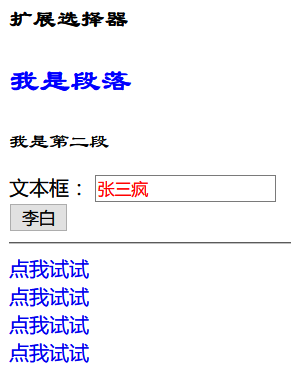

#### 案例代码

```html
<!DOCTYPE html>
<html>
<head>
    <meta charset="UTF-8">
    <title></title>
    <style type="text/css">
        /*层级选择器*/
        div p {
            color: blue;
        }

        /*属性选择器*/
        input[type="text"] {
            color: red;
        }

        /*伪类样式*/
        a:link {
            /*没有下划线*/
            text-decoration: none;
        }

        /*访问过的*/
        a:visited {
            color: gray;
        }

        /*正在激活*/
        a:active {
            color: greenyellow;
        }

        /*鼠标悬停*/
        a:hover {
            color: red;
        }

        /*得到焦点*/
        .user:focus {
            background-color: yellow;
        }

        /*并集选择器*/
        h3, p {
            font-family: 隶书;
        }
    </style>
</head>
<body>
<h3>扩展选择器</h3>

<div>
    <h2>
        <p>我是段落</p>
    </h2>
</div>

<p>我是第二段</p>

文本框：
<input type="text" value="张三疯" class="user"/><br/>
<input type="button" value="李白"/>

<hr/>
<a href="#1">点我试试</a><br/>
<a href="#2">点我试试</a><br/>
<a href="#3">点我试试</a><br/>
<a href="#4">点我试试</a><br/>
</body>
</html>
```


# 第3章 常见的CSS属性

## 3.1 背景样式

### 3.1.1 属性名

| **功能**   | **属性名**             | **属性取值 **                                |
| -------- | ------------------- | ---------------------------------------- |
| **背景色**  | background-color    | 1. 颜色常量，如：red <br />2. 使用十六进制，如：#ABC<br />3. 红绿蓝  使用 rgb(红,绿,蓝) |
| **背景图片** | background-image    | url(图片文件)                                |
| **平铺方式** | background-repeat   | repeat 默认。背景图像将在垂直方向和水平方向重复。   <br />repeat-x 背景图像将在水平方向重复。   <br />repeat-y 背景图像将在垂直方向重复。   <br />no-repeat 背景图像将仅显示一次。 |
| **背景位置** | background-position | left top                                 |

### 3.1.2 演示代码

#### 案例效果

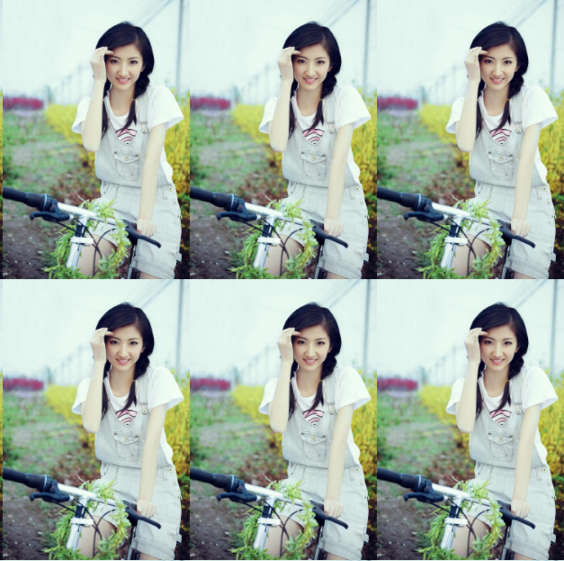

#### 案例代码

```html
<!DOCTYPE html>
<html>
	<head>
		<meta charset="UTF-8">
		<title>背景样式</title>
		<style type="text/css">
			body {
				/*背景色*/
				background-color: yellowgreen;
				/*背景图片*/
				background-image: url(img/girl1.jpg);
				/*平铺方式*/
				background-repeat: repeat;
				/*起始平铺位置*/
				background-position: 50px 50px;
			}
		</style>
	</head>
	<body>
	</body>
</html>
```

## 3.2 文本样式

| **功能**   | **属性名**         | **属性取值**                                 |
| -------- | --------------- | ---------------------------------------- |
| **颜色**   | color           | 颜色常量，如：red  使用十六进制，如：#123  使用rgb(红，绿，蓝)函数 |
| **设置行高** | line-height     | 单位是像素                                    |
| **文字修饰** | text-decoration | underline 下划线  <br />overline 上划线  line-through  删除线 |
| **文本缩进** | text-indent     | 用于缩进文本，可以使用em单位，表示缩进2个字符，无论字符的大小。        |
| **文本对齐** | text-align      | left 把文本排列到左边。默认值：由浏览器决定。   <br />right 把文本排列到右边。   <br />center 把文本排列到中间。 |

## 3.3 字体样式

| **功能**   | **属性名**     | **作用**                                   |
| -------- | ----------- | ---------------------------------------- |
| **字体名**  | font-family | 设置字体，本机必须要有这种字体                          |
| **设置大小** | font-size   | 单位：像素                                    |
| **设置样式** | font-style  | 字体设置为斜体  <br />italic 浏览器会显示一个斜体的字体样式。  <br />normal 默认值。浏览器显示一个标准的字体样式。 |
| **设置粗细** | font-weight | bolder加粗                                 |

## 3.4 案例：选择器与文本样式

#### 案例需求

​	通过学习的选择器和CSS样式，做出如图所示的案例

#### 案例效果

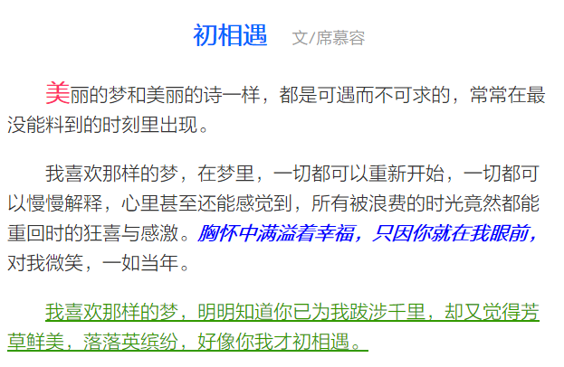	

#### 案例分析

1. 诗放在div的层中，宽400px。标题放在h1中。每段文字放在p中
2. body全文字体大小14px; 颜色：#333，行高30px
3. 标题文字大小18px，颜色#06F，居中对齐
4. 每段文字缩进2em（em是一个相对度量单位，相当于缩进2个字）
5. 段中的行高是22px
6. "胸怀中满溢着幸福，只因你就在我眼前",加粗，倾斜，蓝色，鼠标移上去指针变成手的形状。
7. 最后一段，颜色#390; 下划线，鼠标移上去指针变化。
8. 美字加粗，颜色color:#F36，大小18px;
9. 文席慕容，三个字，12px，颜色#999，不加粗

#### 案例代码

```html
<!DOCTYPE html>
<html>
<head>
<meta charset="UTF-8">
<title>初相遇</title>
<style type="text/css">
    div {
        /*px表示像素*/
        width: 400px;
    }

    body {
        font-size: 14px;
        color: #333;
        /*行高*/
        line-height: 30px;
    }

    h1 {
        font-size: 18px;
        color: #06F;
        /*居中*/
        text-align: center;
    }

    p {
        /*文字缩进2em*/
        text-indent: 2em;
        /*行高是22px*/
        line-height: 22px;
    }

    .xiong {
        /*加粗*/
        font-weight: bolder;
        /*倾斜*/
        font-style: italic;
        /*蓝色*/
        color: blue;
        /*鼠标移上去指针变成手的形状*/
        cursor: pointer;
    }

    #three {
        /*颜色 */
        color: #390;
        /*下划线*/
        text-decoration: underline;
        /*鼠标移上去指针变化*/
        cursor: pointer;
    }

    /*层级选择器*/
    #first span {
        color: #F36;
        font-size: 18px;
    }

    h1 span {
        font-size: 12px;
        color: #999;
        /*不加粗*/
        font-weight: normal;
    }
</style>
</head>
<body>
<div>
<h1>初相遇 <span>文/席慕容</span></h1>
<p id="first">
    <span>美</span>丽的梦和美丽的诗一样，都是可遇而不可求的，常常在最没能料到的时刻里出现。
</p>
<p>
    我喜欢那样的梦，在梦里，一切都可以重新开始，一切都可以慢慢解释，心里甚至还能感觉到，所有被浪费的时光竟然都能重回时的狂喜与感激。
    <span class="xiong">胸怀中满溢着幸福，只因你就在我眼前</span>，对我微笑，一如当年。
</p>
<p id="three">
    我喜欢那样的梦，明明知道你已为我跋涉千里，却又觉得芳草鲜美，落落英缤纷，好像你我才初相遇。
</p>
</div>
</body>
</html>
```

## 3.5 盒子模型

### 3.5.1 什么是盒子模型

​	任何一个网页元素包含由这些属性组成：内容(content)、内边距(padding)、边框(border)、边界(margin)， 这些属性我们可以用日常生活中的常见事物——盒子作一个比喻来理解，所以叫它盒子模型。  

- 内容（content）就是盒子里装的东西；
- 内边距(padding)就是怕盒子里装的东西（贵重的）损坏而添加的泡沫或者其它抗震的辅料；
- 边框(border)就是盒子本身了；
- 外边界(margin)则说明盒子摆放的时候的不能全部堆在一起，要留一定空隙保持通风，同时也为了方便取出。

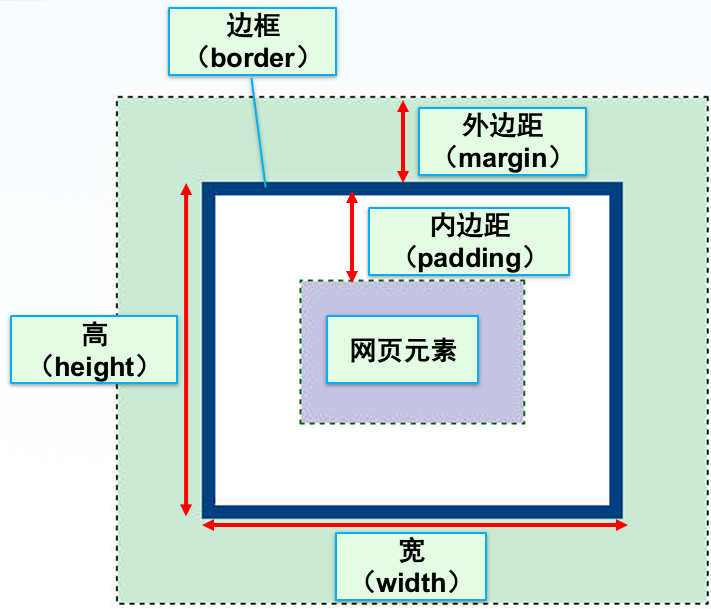

### 3.5.2 盒子模型的属性

| **属性**      | **作用** |
| ----------- | ------ |
| **width**   | 宽度     |
| **height**  | 高度     |
| **margin**  | 外边距    |
| **padding** | 内边距    |
| **border**  | 边框的属性  |

​	归根结底，盒子模型只是一个概念，在盒子模型中，最重要的还是如何理解元素的实际尺寸。

​	盒子模型实际上分为两种，分别是：标准盒模型 和 怪异盒模型。绝大多数元素的尺寸默认是按照标准盒模型计算的。下面是元素的尺寸分别在两种盒模型下计算规则：

 

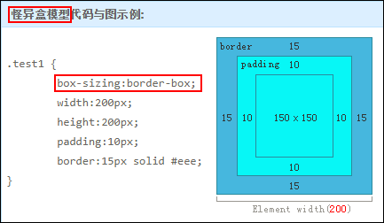                               

**结论：**

在标准盒模型下：

实际宽度 = width+ border(左、右) + padding(左、右)

实际高度 = height+ border(上、下) + padding(上、下) 

在怪异盒模型下：

​          实际宽度 = width

​          实际高度 = height

### 3.5.3 边框样式

#### 边框属性

| **属性**            | **边框样式** | **取值**                                   |
| ----------------- | -------- | ---------------------------------------- |
| **border-style**  | 边框线型     | **dotted**：定义点状边框。在大多数浏览器中呈现为实线。  <br />**dashed**：定义虚线。在大多数浏览器中呈现为实线。                  <br />**solid**：定义实线。                  <br />**double**：定义双线。双线的宽度等于 border-width 的值。 |
| **border-width**  | 边框宽度     | **length**            允许您自定义边框的宽度。       |
| **border-color**  | 边框颜色     | **常量**： 规定颜色值为颜色名称的边框颜色（比如 red）。<br />**十六进制**：十六进制值的边框颜色（比如 #ff0000）。 <br />**函数**: 为 rgb 代码的边框颜色（比如    rgb(255,0,0)）。 |
| **border-radius** | 边框圆角     | 指定圆角的半径                                  |

#### 设置四边值写

| **外边距的写法**                      | **含义**           |
| ------------------------------- | ---------------- |
| **margin:10px**                 | 四边外边距相同          |
| **margin:10px 20px;**           | 上下  左右           |
| **margin:10px 20px 30px;**      | 上  左右  下         |
| **margin:10px 20px 30px 40px;** | 上  右  下  左 (顺时针) |

#### 每条语句设置一边值

| **外边距的写法**               | **含义** |
| ------------------------ | ------ |
| **margin-top:10px;**     | 上外边距   |
| **margin-left:10px;**    | 左外边距   |
| **margin-bottom: 10px;** | 下外边距   |
| **margin-right:10px;**   | 右外边距   |

| **内边距的写法**                | **含义** |
| ------------------------- | ------ |
| **padding-top:10px;**     | 上内边距   |
| **padding-left:10px;**    | 左内边距   |
| **padding-bottom: 10px;** | 下内边距   |
| **padding-right:10px;**   | 右内边距   |

#### 块级元素的居中

```css
margin: auto;
```

## 3.6 display属性

### 3.6.1 作用

控制元素的显示和隐藏

| **取值**     | **作用**    |
| ---------- | --------- |
| **inline** | 设置元素为内联元素 |
| **block**  | 设置元素为块级元素 |
| **none**   | 设置元素不可见   |

### 3.6.2 display案例的演示

#### 案例需求

​	display属性功能的演示

#### 案例效果

​	

#### 案例代码

```html
<!DOCTYPE html>
<html>
<head>
	<meta charset="UTF-8">
	<title></title>
	<style type="text/css">
		div {
			background-color: yellow;
			/*修改成内联元素*/
			display: inline;
		}
		
		span {
			background-color: gold;
			/*修改成块级元素*/
			display: block;
		}
		
		h2 {
			/*元素隐藏*/
			display: none;
		}
	</style>
</head>
<body>
	<div>这是一个块级元素</div>
	<div>这是一个块级元素</div>
	<div>这是一个块级元素</div>
	<span>这是一个内联元素</span>
	<span>这是一个内联元素</span>
	<span>这是一个内联元素</span>
	<h2>你看不见我</h2>
</body>
</html>
```

## 3.7 案例：用户登录

#### 案例需求

​	使用CSS样式排版出如图所示的效果

#### 案例效果

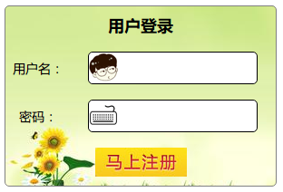

#### 案例分析

1. table居中,宽300px，高180px; 边框solid 1px gray，内边距为0
2. 表格有四行，第一行和第四行跨2列，第一列占30%的宽度，第一行是标题th，第四行是放按钮
3. td的文字对齐居中，字体大小14px
4. table添加背景，重复平铺
5. 用户名和密码文本框使用类样式(也可以使用[条件选择器])，宽150px，高32px，边框用实线，圆角5px，1个宽度，黑色
6. 使用伪类样式，当鼠标移动到文本框上的时候，变成虚线橙色边框。得到焦点，背景色变成浅黄色
7. 文本框前面有头像，密码框前面有键盘，左内边距32
8. 用户登录的标题字体大小18px

#### 案例代码

```html
<!DOCTYPE html>
<html>
<head>
    <meta charset="UTF-8">
    <title></title>
    <style type="text/css">
        table {
            /*居中*/
            margin: auto;
            width: 300px;
            height: 180px;
            /*一条语句设置三个属性: 宽度，线型，颜色*/
            border: 1px solid gray;
            padding: 0px;

            /*背景图片*/
            background-image: url(img/bg1.jpg);

            border-radius: 10px;
        }

        td {
            /*居中*/
            text-align: center;
            font-size: 14px;
        }

        /*并集*/
        .user, .pwd {
            /*宽150px，高32px，边框用实线，圆角5px，1个宽度，黑色*/
            width: 150px;
            height: 32px;
            border: 1px solid black;
            border-radius: 5px;
        }

        /*伪类样式，当鼠标移动到文本框上的时候，变成虚线橙色边框。*/
        .user:hover, .pwd:hover {
            border: 1px dashed orange;
        }

        /*得到焦点，背景色变成浅黄色*/
        .user:focus, .pwd:focus {
            background-color: lightyellow;
        }

        .user {
            background-image: url(img/head.png);
            /*不平铺*/
            background-repeat: no-repeat;
            /*左内边距32*/
            padding-left: 32px;
        }

        .pwd {
            background-image: url(img/keyboard.png);
            /*不平铺*/
            background-repeat: no-repeat;
            /*左内边距32*/
            padding-left: 32px;
        }

        th {
            font-size: 18px;
        }

    </style>
</head>
<body>
<table>
    <tr>
        <th colspan="2">用户登录</th>
    </tr>
    <tr>
        <td width="30%">用户名：</td>
        <td><input type="text" value="" class="user"/></td>
    </tr>
    <tr>
        <td>密码：</td>
        <td><input type="password" value="" class="pwd"/></td>
    </tr>
    <tr>
        <td colspan="2">
            <input type="image" src="img/regbtn.jpg"/>
        </td>
    </tr>
</table>
</body>
</html>
```


# 第4章 综合案例： 黑马旅游注册页面

## 4.1 案例需求

​	使用今天学习的CSS属性，结合div布局和表格布局的方式实现如图所示的注册案例效果

## 4.2 案例效果

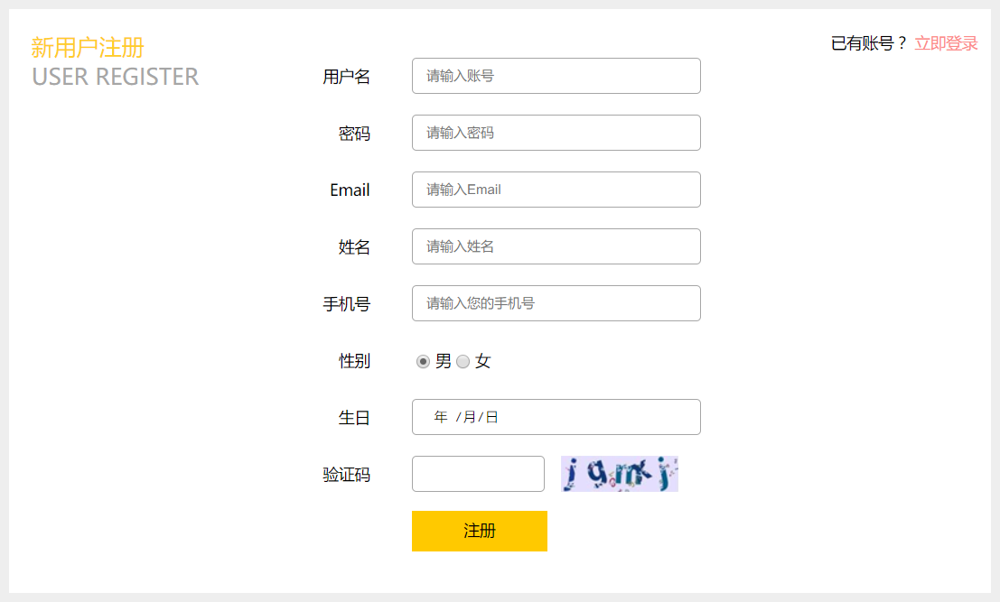

## 4.3 案例分析

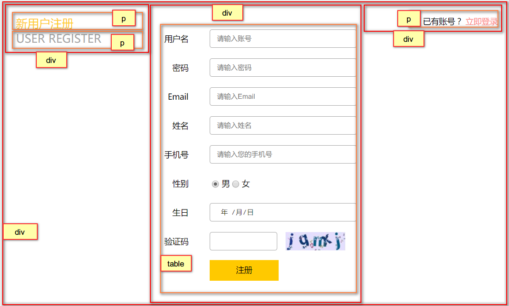

## 4.4 案例步骤

1. 设置所有元素的内外边距为0，设置box-sizing: border-box，即：边框的宽和高就是盒子的宽和高，不会因为内边距或内容的变大而撑大。
2. 创建外面的白色div容器，类名rg_form，宽886，高534，背景色为白色，上下外边距24，左右自动，边框为8，实线，颜色为#eee
3. 左边的的容器，类名为rg_form_left，宽度为256，左浮动，上内边距20，左内边距20
4. "新用户注册"汉字，第1行使用p标签，可以使用伪类样式，p:first-child，字体20，颜色：#ffcd26
5. "新用户注册"第2行英文使用p标签，内容：USER REGISTER，使用伪类样式，p:last-child，字体20，颜色：#a6a6a6
6. 中间注册窗体的容器类名rg_form_center，宽358，左浮动，上内边距10，字体大小14
7. 中间容器中的表格类名rg_table，上外边距25
8. 表单中左边的文字所在单元格，类名td_left，宽65，文本右对齐
9. 表单中右边的输入框单元格类名td_right，宽293，高50
10. 表单中的文本框，日期框，密码框使用属性选择器，宽256，高32，行高32，内边距上下6，左右12，圆角4，边框：1 实线 颜色#a6a6a6，右浮动
11. 性别类名：gender，左内边距40
12. 验证码输入框类名：check，宽118，左浮动，左外边距35，右外边距14
13. 提交按钮类名：submit，宽120，高36，行高36，背景色#ffc900，字体大小14，边框类型为none
14. 右边"已有账号"的容器类名 rg_form_right，宽256，右浮动。
15. 右边的文字p标签，右浮动，字大小14，内边距，上20，右12，下0，左0
16. p内部有个a标签，颜色#fc8989

## 4.5 案例代码

```html
<!DOCTYPE html>
<html lang="en">
<head>
<meta charset="UTF-8">
<title>用户注册</title>
<style type="text/css">
    /* 设置所有元素的内外边距为0 */
    * {
        margin: 0px;
        padding: 0px;
        /*边框的宽和高就是盒子的宽和高，不会因为内边距或内容的变大而撑大*/
        box-sizing: border-box;
    }

    /* 白底的容器 */
    .rg_form {
        width: 886px;
        height: 534px;
        background-color: white;
        /* 上下外边距24，左右居中*/
        margin: 24px auto;
        border: 8px solid #eee;
    }

    /* 左边的"新用户注册"的容器 */
    .rg_form .rg_form_left {
        width: 256px;
        float: left;
        padding-top: 20px;
        padding-left: 20px;
    }

    /* "新用户注册" 汉字 ，第1行p标签 */
    .rg_form > .rg_form_left > p:first-child {
        font-size: 20px;
        color: #ffcd26;
    }

    /* 新用户注册，第2行英文p标签 */
    .rg_form > .rg_form_left > p:last-child {
        font-size: 20px;
        color: #a6a6a6;
    }

    /* 中间注册窗体的容器 */
    .rg_form > .rg_form_center {
        width: 358px;
        float: left;
        padding-top: 10px;
        font-size: 14px;
    }

    /* 表格 */
    .rg_form > .rg_form_center > .rg_table {
        margin-top: 25px;
    }

    /* 表单中左边的文字所在单元格 */
    .td_left {
        width: 65px;
        text-align: right;
    }

    /* 表单中右边输入框所在单元格 */
    .td_right {
        width: 293px;
        height: 50px;
    }

    /* 表单中的文本输入框 */
    input[type="text"], input[type="date"], input[type="password"] {
        width: 256px;
        /* 行高与高度相同，则表示垂直居中 */
        height: 32px;
        line-height: 32px;
        padding: 6px 12px;
        border-radius: 4px;
        border: 1px solid #a6a6a6;
        float: right;
    }

    /* 性别 */
    .gender {
        padding-left: 40px;
    }

    /* 验证码输入框 */
    .td_right > .check {
        width: 118px;
        float: left;
        margin-right: 14px;
        margin-left: 35px;
    }

    /* 提交按钮 */
    .td_right > .submit {
        width: 120px;
        height: 36px;
        line-height: 36px;
        background-color: #ffc900;
        font-size: 14px;
        /* 没有边框 */
        border-style: none;
    }

    /* 右边的"已有账号"的容器 */
    .rg_form > .rg_form_right {
        width: 256px;
        float: right;
    }

    /* 右边的文字p标签 */
    .rg_form > .rg_form_right > p {
        float: right;
        font-size: 14px;
        /* 上右下左*/
        padding: 20px 12px 0 0;
    }

    /* a标签的文字，立即登录的文字 */
    .rg_form > .rg_form_right > p > a {
        color: #fc8989;
    }
</style>
</head>
<body>
<!--白色容器-->
<div class="rg_form">
<!--左边部分-->
<div class="rg_form_left">
    <p>新用户注册</p>
    <p>USER REGISTER</p>
</div>
<!--中间部分-->
<div class="rg_form_center">
    <form action="#" method="get">
        <!--表单部分:9行2列-->
        <table class="rg_table">
            <tr>
                <td class="td_left">
                    <label for="user">用户名</label>
                </td>
                <td class="td_right">
                    <input type="text" id="user" name="user" placeholder="请输入账号">
                </td>
            </tr>
            <tr>
                <td class="td_left">
                    <label for="pwd">密码</label>
                </td>
                <td class="td_right">
                    <input type="password" id="pwd" name="pwd" placeholder="请输入密码">
                </td>
            </tr>
            <tr>
                <td class="td_left">
                    <label for="email">邮箱</label>
                </td>
                <td class="td_right">
                    <input type="text" id="email" name="email" placeholder="请输入Email">
                </td>
            </tr>
            <tr>
                <td class="td_left">
                    <label for="name">姓名</label>
                </td>
                <td class="td_right">
                    <input type="text" name="name" id="name" placeholder="请输入姓名">
                </td>
            </tr>
            <tr>
                <td class="td_left">
                    <label for="mobile">手机号</label>
                </td>
                <td class="td_right">
                    <input type="text" name="mobile" id="mobile" placeholder="请输入您的手机号">
                </td>
            </tr>
            <tr>
                <td class="td_left">
                    性别
                </td>
                <td class="td_right gender">
                    <input type="radio" checked="checked" name="gender" id="male"><label for="male">男</label>&nbsp;
                    <input type="radio" name="gender" id="female"><label for="female">女</label>
                </td>
            </tr>
            <tr>
                <td class="td_left">
                    <label for="birthday">生日</label>
                </td>
                <td class="td_right">
                    <input type="date" name="birthday" id="birthday" placeholder="年/月/日">
                </td>
            </tr>
            <tr>
                <td class="td_left">
                    <label for="vcode">验证码</label>
                </td>
                <td class="td_right">
                    <input type="text" class="check" name="vcode" id="vcode" placeholder="请输入验证码" maxlength="6">
                    
                </td>
            </tr>
            <tr>
                <td>
                </td>
                <td class="td_right">
                    <input type="button" value="注册" class="submit">
                </td>
            </tr>
        </table>
    </form>
</div>
<!--右边部分-->
<div class="rg_form_right">
    <p>
        已有账号?
        <a href="#">立即登录</a>
    </p>
</div>
</div>
</body>
</html>
```

