# 反射、BeanUtils、注解

## 学习目标

1. 能够通过反射技术获取Class字节码对象(重点)
2. 能够通过反射技术获取构造方法对象，并创建对象。(掌握)
3. 能够通过反射获取成员方法对象，并且调用方法。(掌握)
4. 能够通过反射获取属性对象，并且能够给对象的属性赋值和取值。(了解)
5. 能够使用Beanutils常用方法(populate方法)操作JavaBean对象(重点)
6. 能够说出注解的作用(了解)
7. 能够自定义注解和使用注解(掌握)
8. 能够说出常用的元注解及其作用(掌握)
9. 能够解析注解并获取注解中的数据(掌握)
10. 能够完成注解的MyTest案例

# 第1章 反射

## 1.1 反射的基本概念

### 1.1.1 什么是反射

​	反射是一种机制，利用该机制可以在**程序运行过程中**对类进行解剖并操作类中的方法，属性，构造方法等成员。

​	反射又称之为应用程序的自省:也就是获取和操作自身的所有的属性和行为。

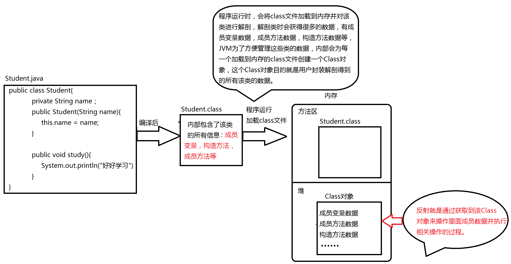

### 1.1.2 反射在实际开发中的应用

1. **开发IDE(集成开发环境)**


- 以上的IDE内部都大量使用了反射机制，我们在使用这些IDE写代码也无时无刻的使用着反射机制，一个常用反射机制的地方就是当我们通过对象调用方法或访问属性时，开发工具都会以列表的形式显示出该对象所有的方法或属性，以供方便我们选择使用，如下图：

  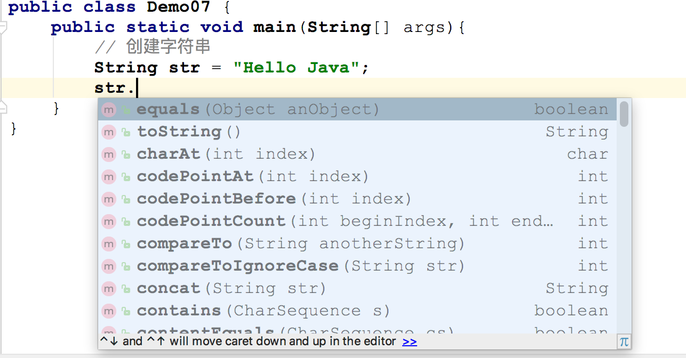

- 这些开发工具之所有能够把该对象的方法和属性展示出来就使用利用了反射机制对该对象所有类进行了解剖获取到了类中的所有方法和属性信息，这是反射在IDE中的一个使用场景。

1. **各种框架的设计**


- 以上三个图标上面的名字就是Java的三大框架，简称SSH.
- 这三大框架的内部实现也大量使用到了反射机制，所有要想学好这些框架，则必须要求对反射机制熟练了。

### 1.1.3 使用反射机制解剖类的前提

​	必须先要获取到该类的字节码文件对象，即**Class类型对象**。关于Class描述字节码文件如下图所示：

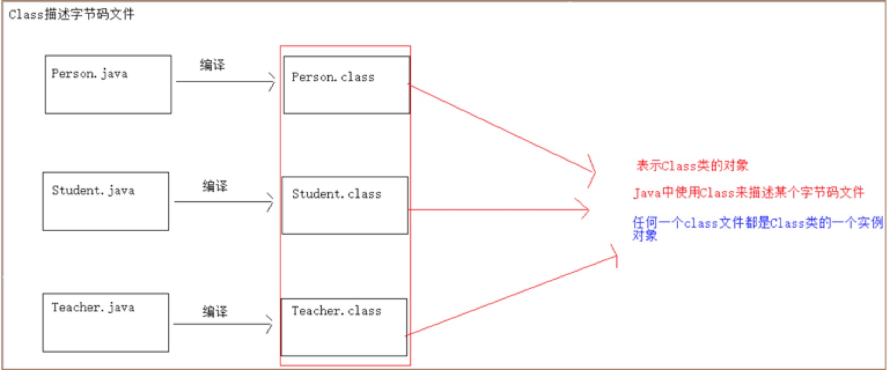

说明：

1）Java中使用Class类表示某个class文件.

2）任何一个class文件都是Class这个类的一个实例对象.

## 1.2 获取Class对象的三种方式

- 创建测试类：Student

```java
public class Student {
    static {
        System.out.println("静态代码块");
    }
    
  	{
        System.out.println("构造代码块");
    }
}
```

### 1.2.1 方式1：通过类名.class获取

```java
public class Demo01 {
    public static void main(String[] args) {
         // 获得Student的Class的对象
        Class c = Student.class;
        // 打印输出：class com.itheima.reflect.Student
        System.out.println(c);
    }
}
```

### 1.2.2  方式2：对像名调用getClass()方法获取

```java
public class Demo01 {
    public static void main(String[] args) {
        // 创建学生对象
        Student stu = new Student();
        // 获得学生类的Class对象
        Class c = stu.getClass();
        // 打印输出：class com.itheima.reflect.Student
        System.out.println(c);
    }
}
```

### 1.2.3  方式3：通过Class.forName("全限定类名")方法获取

```java
public class Demo01 {
    public static void main(String[] args) throws Exception {
        // 获得字符串的Class对象
        Class c = Class.forName("java.lang.String");
        // 打印输出：class java.lang.String
        System.out.println(c);
    }
 }
```


## 1.3 获取Class对象的信息

​	知道怎么获取Class对象之后，接下来就介绍几个Class类中常用的方法了。

### 1.3.1  Class对象相关方法

1. ```java
   String getSimpleName(); 获得简单类名，只是类名，没有包		
   ```

2. ```Java
   String getName(); 获取完整类名，包含包名+类名	
   ```

3. ```java
   T newInstance() ;创建此 Class 对象所表示的类的一个新实例。要求：类必须有public的无参数构造方法
   ```

### 1.3.2  获取简单类名

```java
public class Demo02 {
    public static void main(String[] args) throws Exception {
         // 获得字符串的Class对象
        Class c = Class.forName("java.lang.String");
        // 获得简单类名
        String name = c.getSimpleName();
        // 打印输入：name = String
        System.out.println("name = " + name);
    }
}
```

### 1.3.3 获取完整类名

```java
public class Demo02 {
    public static void main(String[] args) throws Exception {
        // 获得字符串的Class对象
        Class c = Class.forName("java.lang.String");
        // 获得完整类名(包含包名和类名)
        String name = c.getName();
        // 打印输入：name = java.lang.String
        System.out.println("name = " + name);
    }
}
```

### 1.3.4 创建对象

```java
public class Demo02 {
    public static void main(String[] args) throws Exception {
        // 获得字符串的Class对象
        Class c = Class.forName("java.lang.String");
        // 创建字符串对象
        String str = (String) c.newInstance();
        // 输出str：空字符串 ""
        System.out.println(str);
    }
}
```

## 1.4 获取Class对象的Constructor信息

​	一开始在阐述反射概念的时候，我们说到利用反射可以在程序运行过程中对类进行解剖并操作里面的成员。而一般常操作的成员有构造方法，成员方法，成员变量等等，那么接下来就来看看怎么利用反射来操作这些成员以及操作这些成员能干什么，先来看看怎么操作构造方法。而要通过反射操作类的构造方法，我们需要先知道一个Constructor类。

### 1.4.1 Constructor类概述

​	Constructor是构造方法类，类中的每一个构造方法都是Constructor的对象，通过Constructor对象可以实例化对象。

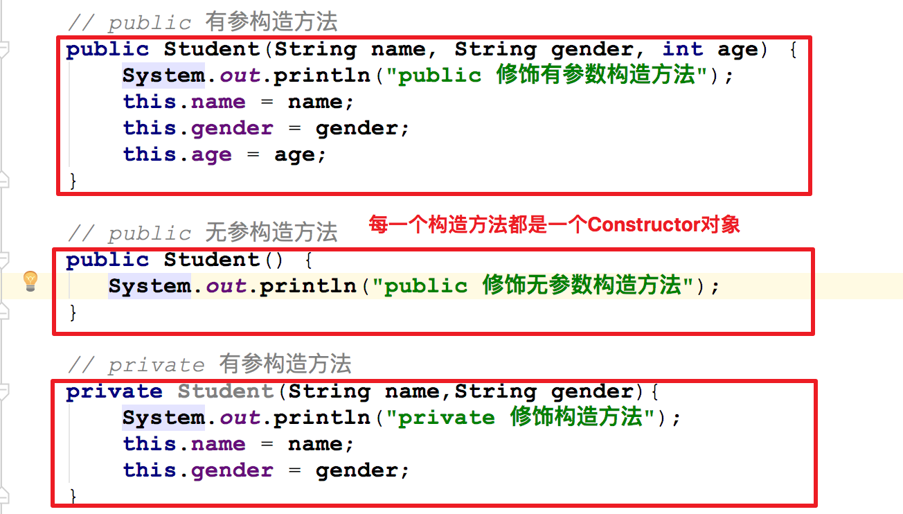

### 1.4.2 Class类中与Constructor相关方法

```java
1. Constructor getConstructor(Class... parameterTypes) 
    根据参数类型获取构造方法对象，只能获得public修饰的构造方法。
	如果不存在对应的构造方法，则会抛出 java.lang.NoSuchMethodException 异常。
	
2. Constructor getDeclaredConstructor(Class... parameterTypes)
  	根据参数类型获取构造方法对象，包括private修饰的构造方法。
  	如果不存在对应的构造方法，则会抛出 java.lang.NoSuchMethodException 异常。
   
3. Constructor[] getConstructors() 
   	获取所有的public修饰的构造方法
   
4. Constructor[] getDeclaredConstructors()
   	获取所有构造方法，包括privat修饰的
```

### 1.4.3 Constructor类中常用方法

```java
1. T newInstance(Object... initargs) 
  	根据指定参数创建对象。
2. void setAccessible(true)
  	暴力反射，设置为可以直接访问私有类型的构造方法。
```

### 1.4.4 示例代码

1. 学生类

```java
/**
 * @author pkxing
 * @version 1.0
 * @description com.itheima
 * @date 2018/1/25
 */
public class Student {
    // 姓名
    private String name;
    // 性别
    public String gender;
    // 年龄
    private int age;


    // public 有参构造方法
    public Student(String name, String gender, int age) {
        System.out.println("public 修饰有参数构造方法");
        this.name = name;
        this.gender = gender;
        this.age = age;
    }

    // public 无参构造方法
    public Student() {
        System.out.println("public 修饰无参数构造方法");
    }

    // private 有参构造方法
    private Student(String name,String gender){
        System.out.println("private 修饰构造方法");
        this.name = name;
        this.gender = gender;
    }

    // getter & setter 方法
    public String getName() {
        return name;
    }

    public void setName(String name) {
        this.name = name;
    }

    public String getGender() {
        return gender;
    }

    public void setGender(String gender) {
        this.gender = gender;
    }

    public int getAge() {
        return age;
    }

    public void setAge(int age) {
        this.age = age;
    }

    // 普通方法
    public void sleep(){
        System.out.println("睡觉");
    }

    public void sleep(int hour){
        System.out.println("public修饰---sleep---睡" + hour + "小时");
    }

    private void eat(){
        System.out.println("private修饰---eat方法---吃饭");
    }

    // 静态方法
    public static void study(){
        System.out.println("静态方法---study方法---好好学习Java");
    }

    @Override
    public String toString() {
        return "Student{" +
                "name='" + name + '\'' +
                ", gender='" + gender + '\'' +
                ", age=" + age +
                '}';
    }
}
```

1. 测试类

```java
/**
 * @author pkxing
 * @version 1.0
 * @description 获取Class对象的Constructor信息
 * @date 2018/1/26
 */
public class Demo03 {
    public static void main(String[] args)throws Exception{
        test01();
        test02();
        test03();
        test04();
    }

    /**
     4. Constructor[] getDeclaredConstructors()
        获取所有构造方法，包括privat修饰的
     */
    public static void test04() throws Exception{
        System.out.println("----------- test04() -----------");
        // 获取Student类的Class对象
        Class c = Student.class;
        // 获取所有的public修饰的构造方法
        Constructor[] cons = c.getDeclaredConstructors();
        // 遍历构造方法数组
        for(Constructor con:cons) {
            // 输出con
            System.out.println(con);
        }
    }

    /**
     3. Constructor[] getConstructors()
        获取所有的public修饰的构造方法
     */
    public static void test03() throws Exception{
        System.out.println("----------- test03() -----------");
        // 获取Student类的Class对象
        Class c = Student.class;
        // 获取所有的public修饰的构造方法
        Constructor[] cons = c.getConstructors();
        // 遍历构造方法数组
        for(Constructor con:cons) {
            // 输出con
            System.out.println(con);
        }
    }

    /**
     2. Constructor getDeclaredConstructor(Class... parameterTypes)
        根据参数类型获取构造方法对象，包括private修饰的构造方法。
        如果不存在对应的构造方法，则会抛出 java.lang.NoSuchMethodException 异常。
     */
    public static void test02() throws Exception{
        System.out.println("----------- test02() -----------");
        // 获取Student类的Class对象
        Class c = Student.class;
        // 根据参数获取对应的private修饰构造方法对象
        Constructor cons = c.getDeclaredConstructor(String.class,String.class);
        // 注意：private的构造方法不能直接调用newInstance创建对象，需要暴力反射才可以
        // 设置取消权限检查（暴力反射）
        cons.setAccessible(true);
        // 调用Constructor方法创建学生对象
        Student stu = (Student) cons.newInstance("林青霞","女");
        // 输出stu
        System.out.println(stu);
    }
    /**
     1. Constructor getConstructor(Class... parameterTypes)
     根据参数类型获取构造方法对象，只能获得public修饰的构造方法。
     如果不存在对应的构造方法，则会抛出 java.lang.NoSuchMethodException 异常。
     */
    public static void test01() throws Exception{
        System.out.println("----------- test01() -----------");
        // 获取Student类的Class对象
        Class c = Student.class;
        // 根据参数获取对应的构造方法对象
        Constructor cons = c.getConstructor(String.class,String.class,int.class);
        // 调用Constructor方法创建学生对象
        Student stu = (Student) cons.newInstance("张曼玉","女",28);
        // 输出stu
        System.out.println(stu);
    }
}
```

- 输出结果：

  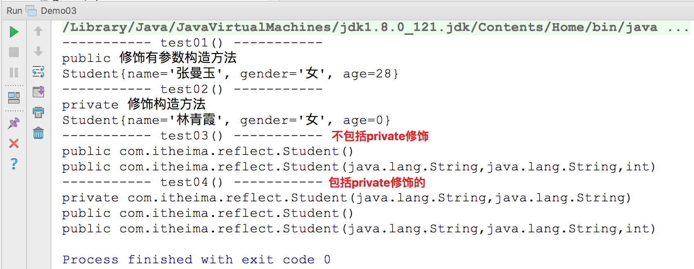

## 1.5 获取Class对象的Method信息

​	操作完构造方法之后，就来看看反射怎么操作成员方法了。同样的在操作成员方法之前我们需要学习一个类：Method类。

### 1.5.1 Method类概述

​	Method是方法类，类中的每一个方法都是Method的对象，通过Method对象可以调用方法。	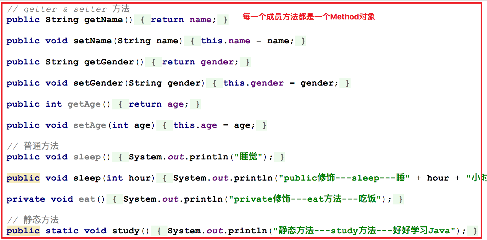

### 1.5.2 Class类中与Method相关方法

```java
1. Method getMethod("方法名", 方法的参数类型... 类型) 
	根据方法名和参数类型获得一个方法对象，只能是获取public修饰的
	
2. Method getDeclaredMethod("方法名", 方法的参数类型... 类型)
  	根据方法名和参数类型获得一个方法对象，包括private修饰的
  	
3. Method[] getMethods()
  	获取所有的public修饰的成员方法，包括父类中。

4. Method[] getDeclaredMethods()
  	获取当前类中所有的方法，包含私有的，不包括父类中。
```

### 1.5.3 Method类中常用方法

```java
1.  Object invoke(Object obj, Object... args) 
  	根据参数args调用对象obj的该成员方法	
  	如果obj=null，则表示该方法是静态方法
  
2.  void setAccessible(boolean flag) 
  	暴力反射，设置为可以直接调用私有修饰的成员方法
```

### 1.5.4 示例代码

```java
/**
 * @author pkxing
 * @version 1.0
 * @description 获取Class对象的Method信息
 * @date 2018/1/26
 */
public class Demo04 {
    public static void main(String[] args)throws  Exception{
        // 获得Class对象
        Class c = Student.class;
        // 快速创建一个学生对象
        Student stu = (Student ) c.newInstance();

        // 获得public修饰的方法对象
        Method m1 = c.getMethod("sleep",int.class);
        // 调用方法m1
        m1.invoke(stu,8);

        // 获得private修饰的方法对象
        Method m2 = c.getDeclaredMethod("eat");
        // 注意：private的成员方法不能直接调用，需要暴力反射才可以
        // 设置取消权限检查（暴力反射）
        m2.setAccessible(true);
        // 调用方法m2
        m2.invoke(stu);

        // 获得静态方法对象
        Method m3 = c.getDeclaredMethod("study");
        // 调用方法m3
        // 注意：调用静态方法时，obj可以为null
        m3.invoke(null);
      
        System.out.println("------------获得所有public的方法，不包括private，包括父类的---------------");
        // 获得所有public的方法，包括父类的
        Method[] ms = c.getMethods();
        // 遍历方法数组
        for(Method m : ms) {
            System.out.println(m);
        }

        System.out.println("-----------获得所有方法,包括private，不包括父类-----------------------");
        // 获得所有方法,包括private，不包括父
        Method[] ms2 = c.getDeclaredMethods();
        // 遍历方法数组
        for(Method m : ms2) {
            System.out.println(m);
        }
    }
}
```

- 输出结果：

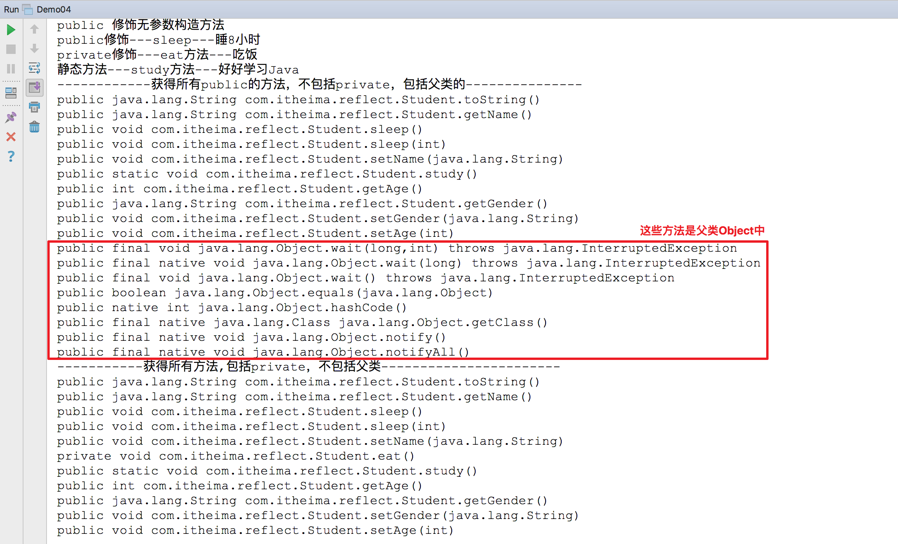

## 1.6 获取Class对象的Field信息

### 1.6.1 Field类概述

​	Field是属性类，类中的每一个属性(成员变量)都是Field的对象，通过Field对象可以给对应的成员变量赋值和取值。


### 1.6.2 Class类中与Field相关方法

```java
1. Field getDeclaredField(String name) 
   根据属性名获得属性对象，包括private修饰的
 
2. Field getField(String name) 
   根据属性名获得属性对象，只能获取public修饰的
   
3. Field[]	getFields() 
    获取所有的public修饰的属性对象，返回数组。
    
4. Field[]	getDeclaredFields() 
  	获取所有的属性对象，包括private修饰的，返回数组。
```

### 1.6.3 Field类中常用方法

```java
void  set(Object obj, Object value) 
void setInt(Object obj, int i) 	
void setLong(Object obj, long l)
void setBoolean(Object obj, boolean z) 
void setDouble(Object obj, double d) 

Object get(Object obj)  
int	getInt(Object obj) 
long getLong(Object obj) 
boolean getBoolean(Object ob)
double getDouble(Object obj) 

void setAccessible(true);暴力反射，设置为可以直接访问私有类型的属性。
Class getType(); 获取属性的类型，返回Class对象。
```

- setXxx方法都是给对象obj的属性设置使用，针对不同的类型选取不同的方法。
- getXxx方法是获取对象obj对应的属性值的，针对不同的类型选取不同的方法。

### 1.6.4 示例代码

```Java

/**
 * @author pkxing
 * @version 1.0
 * @description 获取Class对象的Field信息
 * @date 2018/1/26
 */
public class Demo05 {
    public static void main(String[] args)throws Exception{
        // 获得Class对象
        Class c = Student.class;
        // 快速创建一个学生对象
        Student stu = (Student ) c.newInstance();

        // 获得public修饰Field对象
        Field f1 = c.getField("gender");
        // 通过f1对象给对象stu的gender属性赋值
        f1.set(stu,"风清扬");
        // 通过f1对象获取对象stu的gender属性值
        String gender = (String) f1.get(stu);
        System.out.println("性别：" + gender);

        // 获得private修饰Field对象
        Field f2 = c.getDeclaredField("age");
        // 注意：private的属性不能直接访问，需要暴力反射才可以
        // 设置取消权限检查（暴力反射）
        f2.setAccessible(true);
        // 通过f1对象给对象stu的age属性赋值
        f2.setInt(stu,30);
        // 通过f2对象获取对象stu的age属性值
        int age = f2.getInt(stu);
        System.out.println("年龄：" + age);


        System.out.println("-------获得所有public修饰的属性--------");
        // 获得所有public修饰的属性
        Field[] fs1 = c.getFields();
        // 遍历数组
        for(Field f : fs1) {
            System.out.println(f);
        }

        System.out.println("-------获得所有的属性，包括private修饰--------");
        // 获得所有的属性，包括private修饰
        Field[] fs2 = c.getDeclaredFields();
        // 遍历数组
        for(Field f : fs2) {
            System.out.println(f);
        }
    }
}
```

- 输出结果


## 1.7 反射案例

### 1.7.1 案例说明

​	编写一个工厂方法可以根据配置文件产任意类型的对象。

- 例如有配置文件stu.properties，存储在项目的src文件夹下，内容如下：

  class=com.itheima.reflect.Student
  name=rose
  gender=女
  age=18
- 根据配置文件信息创建一个学生对象。

### 1.7.2 实现步骤分析

1. 在项目src文件中新建一个包：com.itheima.reflect，并在该包下创建Student类。
2. Student类的属性：String name，String gender，int age
3. 定义一个工厂方法：createObject()，方法返回值类型为：Object
4. 创建Properties集合并读取stu.properties文件中的内容到集合中。
5. 根据class获得学生类全名，并通过反射技术获得Class对象。
6. 通过调用Class对象的方法创建学生对象。
7. 遍历Properties集合，利用反射技术给学生成员变量赋值。
8. 返回封装好数据的学生对象。

### 1.7.3 案例代码

```java
/**
 * @author pkxing
 * @version 1.0
 * @description com.itheima.reflect
 * @date 2018/1/26
 */
public class Demo06 {

    public static void main(String[] args){
        // 获取对象
        Student stu = (Student) createObject();
        // 输出对象
        System.out.println(stu);
    }

    /**
     * 根据配置文件创建对象
     */
    public static Object createObject(){
        try {
            // 创建属性集合
            Properties pro = new Properties();
            // 从文件中加载内容到集合中
            pro.load(Demo06.class.getResourceAsStream("/stu.properties"));

            // 从集合中获得类名
            String className = pro.getProperty("class");
            // 通过反射获得Class对象
            Class c = Class.forName(className);
            // 快速创建对象
            Object obj = c.newInstance();
            // 遍历集合
            Set<String> names = pro.stringPropertyNames();
            for (String name : names) {
                // 判断name是否class
                if (name.equals("class")) continue;
                // 获得值
                String value = pro.getProperty(name);
                // name：成员变量名
                // 根据成员变量名获得对应的Field对象
                Field f = c.getDeclaredField(name);
                // 暴力反射
                f.setAccessible(true);
                // 获得成员变量的类型
                Class typeClass = f.getType();
                if(typeClass == int.class){  // 判断成员变量的数据类型是否是int类型
                    f.setInt(obj, Integer.parseInt(value));
                } else {
                    // 给f对象的赋值
                    f.set(obj, value);
                }
            }
            // 返回对象
            return obj;
        }   catch (Exception e) {
            throw new RuntimeException(e);
        }
    }
}
```

### 1.7.4 案例小结

​	该反射案例的目的是让同学们感受反射机制的强大之处，在后面即将学习的Spring框架中就会有大量根据配置文件信息创建对象的过程，其内部的原理和我们这个案例的原理是一样，有这个案例做基础，以后学到spring框架时就会容易理解了。

​	可能有同学有这样的想法，反射机制确实是强大，但是如果从每次配置文件中读取信息给对象属性赋值时都需要写这么复杂的代码，做这么多条件判断的话，那就会严重影响工作效率，有没有更好的方式来更方便，更有效率的解决这个问题？答案就是：有，如果想使用更方便的方式给对象封装数据的话，我们可以使用一个非常方便的第三方工具：**BeanUtils**。接下来就来看看BeanUtils是什么以及怎么使用。

# 第2章 BeanUtils

## 2.1 BeanUtils的基本概述

### 2.2.1 BeanUtils概述

​	BeanUtils是Apache commons组件的成员之一，**主要用于简化JavaBean封装数据的操作**。常用的操作有以下三个：

- 对JavaBean的属性进行赋值和取值。
- 将一个JavaBean所有属性赋值给另一个JavaBean对象中。
- 将一个Map集合的数据封装到一个JavaBean对象中。


### 2.2.2 JavaBean概述

1. **JavaBean就是一个类，但该类需要满足以下三个条件：**
   - 类必须使用public修饰。

   - 提供无参数的构造器。

   - 提供getter和setter方法访问属性。

2. **JavaBean的两个重要概念**

   - 字段：就是成员变量，字段名就是成员变量名。
   - 属性：属性名通过setter/getter方法去掉set/get前缀，首字母小写获得。


     - 比如：setName() --> Name --> name
     - 一般情况下，字段名称和属性名称是一致的。 

1. **字段名和属性名不一致的情况**

```Java
// 成员变量
private String description;
// getter & setter 方法
public String getDesc(){
  	return this.description;
}
public void setDesc(String desc) {
  	this.descripiton = desc;
}
```

- 此时字段名为：**description**，属性名为：**desc**

### 2.2.3 BeanUtils相关Jar包

1. **下载地址：*http://commons.apache.org/***

   

2. **相关的jar包**

```java
commons-beanutils-1.9.3.jar   // 工具核心包
commons-logging-1.2.jar       // 日志记录包 
commons-collections-3.2.2.jar // 增强的集合包 
```


## 2.2 BeanUtils的基本使用

### 2.2.1 导入相关jar包

1. **在项目根目录下创建lib文件夹，并将jar包复制到该文件夹下，如下图：**

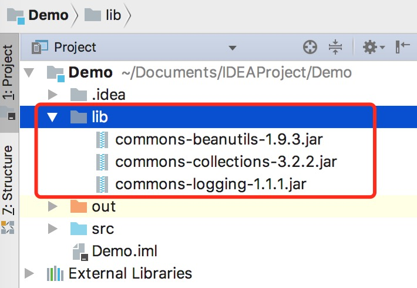

1. **添加依赖：关联lib文件夹，通知idea去到该文件夹找jar。如下图：**

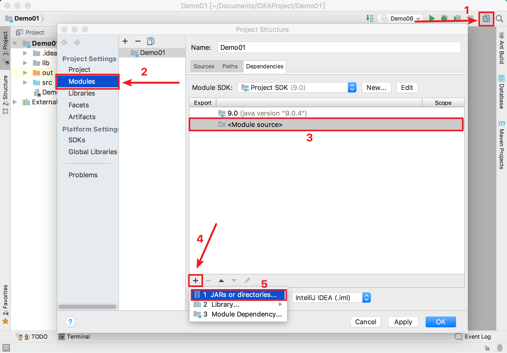

1. **如上图，当执行到第5步时，在弹出对话框中找到项目中lib文件夹，点击打开之后如下图：**

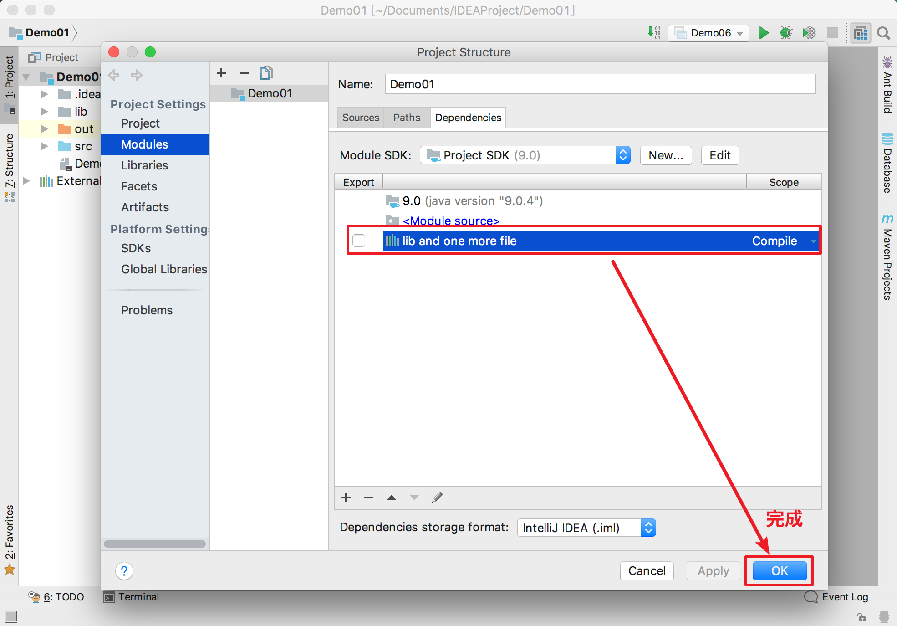

1. **点击OK完成导入jar操作，此时就可以在项目中使用BeanUtils工具类提供的功能了。**

### 2.2.2 BeanUtils工具类中常用方法

1. ```Java
   public static void setProperty(Object bean, String name, Object value)
   给指定对象bean的指定name属性赋值为指定值value。
   如果指定的属性不存在，则什么也不发生。
   ```

2. ```Java
   public static String getProperty(Object bean, String name)
   获取指定对象bean指定name属性的值。
   如果指定的属性不存在，则会抛出异常。
   注意；当属性的类型是数组类型时，获取到的值数组中的第一个值。
   ```

3. ```java
   public static void copyProperties(Object dest, Object orig)
   将对象orig的属性值赋值给对象dest对象对应的属性
   注意：只有属性名名相同且类型一致的才会赋值成功。
   ```

4. ```java
   public static void populate(Object bean, Map<String, ? extends Object> properties)
   将一个Map集合中的数据封装到指定对象bean中
   注意：对象bean的属性名和Map集合中键要相同。
   ```

### 2.2.3 BeanUtils常用操作演示

#### 2.2.3.1 创建一个JavaBean类：Student

```java
/**
 * @author pkxing
 * @version 1.0
 * @description com.itheima
 * @date 2018/1/25
 */
public class Student {
    // 姓名
    private String name;
    // 性别
    private String gender;
    // 年龄
    private int age;
    // 爱好
    private String[] hobbies;

    public Student() {
        
    }

    public String getName() {
        return name;
    }

    public void setName(String name) {
        this.name = name;
    }

    public String getGender() {
        return gender;
    }

    public void setGender(String gender) {
        this.gender = gender;
    }

    public int getAge() {
        return age;
    }

    public void setAge(int age) {
        this.age = age;
    }

    public String[] getHobbies() {
        return hobbies;
    }

    public void setHobbies(String[] hobbies) {
        this.hobbies = hobbies;
    }

    @Override
    public String toString() {
        return "Student{" +
                "name='" + name + '\'' +
                ", gender='" + gender + '\'' +
                ", age=" + age +
                ", hobbies=" + Arrays.toString(hobbies) +
                '}';
    }
}
```

#### 2.2.3.2 对JavaBean的属性进行赋值和取值

```java
/**
 * @author pkxing
 * @version 1.0
 * @description 对JavaBean的属性进行赋值和取值。
 * @date 2018/1/25
 */
public class BeanUtilsDemo01 {
  	/**
  	 public static void setProperty(Object bean, String name, Object value)
		给指定对象bean的指定name属性赋值为指定值value。
		如果指定的属性不存在，则什么也不发生。
		
	public static String getProperty(Object bean, String name)
		获取指定对象bean指定name属性的值。
		如果指定的属性不存在，则会抛出异常。
		注意；当属性的类型是数组类型时，获取到的值数组中的第一个值。
  	 */
    public static void main(String[] args) throws Exception {
        // 创建学生对象
        Student stu = new Student();
        // 调用BeanUtils工具类的方法给对象属性赋值
        BeanUtils.setProperty(stu,"name","风清扬");
        BeanUtils.setProperty(stu,"gender","男");
        BeanUtils.setProperty(stu,"age",40);
        BeanUtils.setProperty(stu,"hobbies",new String[]{"敲代码","打篮球"});
        // 输出对象到控制台
        System.out.println(stu);
        // 调用BeanUtils工具类的方法获取对象属性值
        String name = BeanUtils.getProperty(stu,"name");
        String gender = BeanUtils.getProperty(stu,"gender");
        String age = BeanUtils.getProperty(stu,"age");
        String hobbies = BeanUtils.getProperty(stu,"hobbies");
        System.out.println("姓名："+ name);
        System.out.println("性别："+ gender);
        System.out.println("年龄：" + age);
        System.out.println("爱好：" + hobbies);
    }
}
```

- 输出结果：


#### 2.2.3.3 将一个JavaBean对象的属性赋值给另一个JavaBean对象。

1.  **相同类型的对象之间属性赋值**

```java
/**
 * @author pkxing
 * @version 1.0
 * @description 将一个JavaBean对象的属性赋值给另一个JavaBean对象。
 * @date 2018/1/25
 */
public class BeanUtilsDemo02 {
    /**
     	public static void copyProperties(Object dest, Object orig)
		将对象orig的属性值赋值给对象dest对象对应的属性
		注意：只有属性名名相同且类型一致的才会赋值成功。
     * @throws Exception
     */
    public static void main(String[] args)throws Exception{
        // 创建学生对象
        Student stu = new Student();
        // 调用BeanUtils工具类的方法给对象属性赋值
        BeanUtils.setProperty(stu,"name","风清扬");
        BeanUtils.setProperty(stu,"gender","男");
        BeanUtils.setProperty(stu,"age",40);
        BeanUtils.setProperty(stu,"hobbies",new String[]{"敲代码","打篮球"});

        // 再创建一个学生对象
        Student newStu = new Student();
        // 调用BeanUtils工具类的方法将stu对象的属性值赋值给newStu对象
        BeanUtils.copyProperties(newStu,stu);
        // 输出stu和newStu对象
        System.out.println(stu);
        System.out.println(newStu);
    }
}
```

- 输入结果：


1. **不同类型的对象之间属性赋值：只有属性名相同的才会被赋值**

- 创建JavaBean用户类：User

```java
public class User {
    // 姓名
    private String name;
    // 性别
    private String gender;
    // 地址
    private String address;
    // 年龄
    private String age;

    public User() {

    }

    public String getAddress() {
        return address;
    }

    public void setAddress(String address) {
        this.address = address;
    }

    public String getAge() {
        return age;
    }

    public void setAge(String age) {
        this.age = age;
    }

    public String getName() {
        return name;
    }

    public void setName(String name) {
        this.name = name;
    }

    public String getGender() {
        return gender;
    }

    public void setGender(String gender) {
        this.gender = gender;
    }

    @Override
    public String toString() {
        return "User{" +
                "name='" + name + '\'' +
                ", gender='" + gender + '\'' +
                ", address='" + address + '\'' +
                ", age='" + age + '\'' +
                '}';
    }
}
```

- 示例代码

```java
/**
 * @author pkxing
 * @version 1.0
 * @description 将一个JavaBean对象的属性赋值给另一个JavaBean对象。
 * @date 2018/1/25
 */
public class BeanUtilsDemo03 {
    /**
     	public static void copyProperties(Object dest, Object orig)
		将对象orig的属性值赋值给对象dest对象对应的属性
		注意：只有属性名名相同且类型一致的才会赋值成功。
     */
    public static void main(String[] args)throws Exception {
        // 创建学生对象
        Student stu = new Student();
        // 调用BeanUtils工具类的方法给对象属性赋值
        BeanUtils.setProperty(stu,"name","风清扬");
        BeanUtils.setProperty(stu,"gender","男");
        BeanUtils.setProperty(stu,"age",40);
        BeanUtils.setProperty(stu,"aaa","xxx");
        BeanUtils.setProperty(stu,"hobbies",new String[]{"敲代码","打篮球"});

        // 创建用户对象
        User user = new User();
        // 调用BeanUtils工具类的方法将stu对象的属性值赋值给user对象
        BeanUtils.copyProperties(user,stu);
        // 输出stu和user对象
        System.out.println(user);
        System.out.println(stu);
    }
}
```

* 输出结果


#### 2.2.3.4 将一个Map集合的数据封装到一个JavaBean对象中。(重点)

```java
/**
 * @author pkxing
 * @version 1.0
 * @description 将一个Map集合的数据封装到一个JavaBean对象中。
 * @date 2018/1/25
 */
public class BeanUtilsDemo04 {
    /**
     * 
     public static void populate(Object bean, Map<String, ? extends Object> properties)
     将一个Map集合中的数据封装到指定对象bean中
     注意：对象bean的属性名和Map集合中键要相同。
     * @param args
     * @throws Exception
     */
    public static void main(String[] args) throws Exception {
        // 创建map集合
        Map<String,Object> map = new HashMap<String, Object>();
        map.put("name","林青霞");
        map.put("gender","女");
        map.put("age","38");
        map.put("hobbies",new String[]{"唱歌","跳舞"});
        // 创建学生对象
        Student stu = new Student();
        System.out.println("封装前：" + stu);
        // 调用BeanUtils工具类的方法将map数据封装到stu中
        BeanUtils.populate(stu,map);
        // 输出对象stu
        System.out.println("封装后：" + stu);
    }
}
```

- 输出结果


# 第3章 注解

## 3.1 注解的概述

### 3.1.1 注解的概念

- 注解是JDK1.5的新特性。


- 注解相当一种标记，是类的组成部分，可以给类携带一些额外的信息。

- 标记(注解)可以加在包，类，字段，方法，方法参数以及局部变量上。

- 注解是给编译器或JVM看的，编译器或JVM可以根据注解来完成对应的功能。

  ###### *注解(Annotation)相当于一种标记，在程序中加入注解就等于为程序打上某种标记，以后，javac编译器、开发工具和其他程序可以通过反射来了解你的类及各种元素上有无何种	标记，看你的程序有什么标记，就去干相应的事，标记可以加在包、类，属性、方法，方法的参数以及局部变量上。*

### 3.1.2 注解的作用

 **注解的作用就是给程序带入参数。**

以下几个常用操作中都使用到了注解：

1. **生成帮助文档**：**@author和@version**

   - **@author**：用来标识作者姓名。

   - **@version**：用于标识对象的版本号，适用范围：文件、类、方法。

     - 使用**@author和@version**注解就是告诉**Javadoc工具**在生成帮助文档时把作者姓名和版本号也标记在文档中。如下图：

       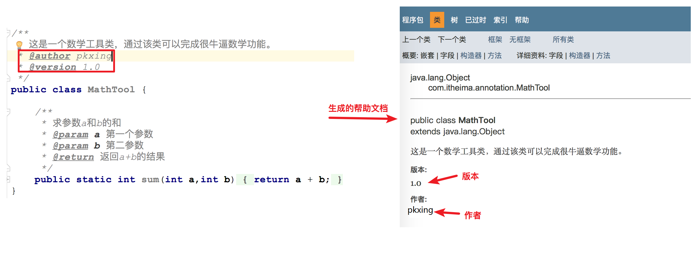

2. **编译检查**：**@Override**

   - **@Override**：用来修饰方法声明。

     - 用来告诉**编译器**该方法是重写父类中的方法，如果父类不存在该方法，则编译失败。如下图

     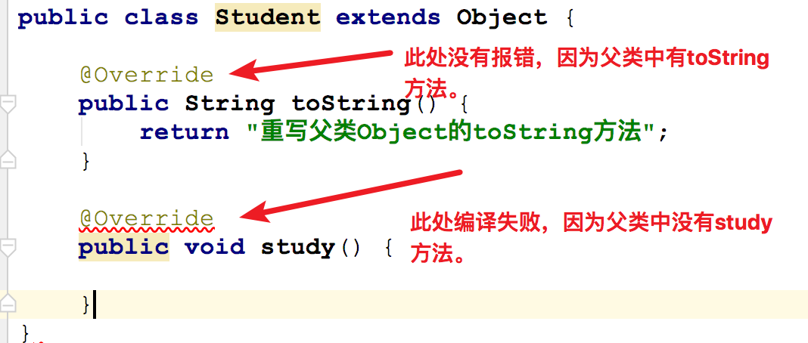

3. **框架的配置(框架=代码+配置)**

   - 具体使用请关注框架课程的内容的学习。
   - 也就是代替框架中的配置文件

4. **作为标记**，就比如说Junit单元测试中:@Test

### 3.1.3 常见注解

1. **@author**：用来标识作者名，eclipse开发工具默认的是系统用户名。
2. **@version**：用于标识对象的版本号，适用范围：文件、类、方法。
3. **@Override** ：用来修饰方法声明，告诉编译器该方法是重写父类中的方法，如果父类不存在该方法，则编译失败。


## 3.2 自定义注解

### 3.2.1 定义格式

```java
public @interface 注解名{

}
如：定义一个名为Student的注解
public @interface Student {

} 
```

- 以上定义出来的注解就是一个最简单的注解了，但这样的注解意义不大，因为注解中没有任何内容，就好像我们定义一个类而这个类中没有任何成员变量和方法一样，这样的类意义也是不大的，所以在定义注解时会在里面添加一些成员来让注解功能更加强大，这些成员就是属性。接下来就看看怎么给注解添加属性。

### 3.2.2 注解的属性

1. **属性的作用**

   - 可以让用户在使用注解时传递参数，让注解的功能更加强大。

2. **属性的格式**

   - **格式1：数据类型 属性名();**
   - **格式2：数据类型 属性名() default 默认值;**

3. **属性定义示例**

   ```java
   public @interface Student {
     String name(); // 姓名
     int age() default 18; // 年龄
     String gender() default "男"; // 性别
   } 
   // 该注解就有了三个属性：name，age，gender
   ```

4. **属性适用的数据类型**

   - 八种基本数据类型（**int,float,boolean,byte,double,char,long,short**)
   - String类型，Class类型，枚举类型，注解类型
   - 以上所有类型的一维数组

## 3.3 使用自定义注解

### 3.3.1 定义注解

1. **定义一个注解：Book**
   - 包含属性：String value()   书名
   - 包含属性：double price()  价格，默认值为 100
   - 包含属性：String[] authors() 多位作者    


1. **代码实现**

   ```java
   public @interface Book {
           // 书名
           String value();
           // 价格
           double price() default 100;
           // 多位作者
           String[] authors();
   }
   ```

### 3.3.2 使用注解

1. **定义类在成员方法上使用Book注解**

   ```java
   /**
    * @author pkxing
    * @version 1.0
    * @description 书架类
    * @date 2018/1/26
    */
   public class BookShelf {
     
       @Book(value = "西游记",price = 998,authors = {"吴承恩","白求恩"})
       public void showBook(){

       }
   }
   ```

2. **使用注意事项**

   - 如果属性有默认值，则使用注解的时候，这个属性可以不用赋值。

   * 如果属性没有默认值，那么在使用注解时一定要给属性赋值。 

### 3.3.3 特殊属性value

1. **当注解中只有一个属性且名称是value，在使用注解时给value属性赋值可以直接给属性值，无论value是单值元素还是数组类型。**

```java
// 定义注解Book
public @interface Book {
        // 书名
        String value();
}

// 使用注解Book
public class BookShelf {
    @Book("西游记")
    public void showBook(){

    }
}
或
public class BookShelf {
    @Book(value="西游记")
    public void showBook(){

    }
}
```
1.  **如果注解中除了value属性还有其他属性，且至少有一个属性没有默认值，则在使用注解给属性赋值时，value属性名不能省略。**

```java
// 定义注解Book
public @interface Book {
        // 书名
        String value();
  		// 价格
        double price() default 100;
        // 多位作者
        String[] authors();
}
// 使用Book注解：正确方式
@Book(value="红楼梦",authors = "曹雪芹")
public class BookShelf {
  // 使用Book注解：正确方式
    @Book(value="西游记",authors = {"吴承恩","白求恩"})
    public void showBook(){

    }
}

// 使用Book注解：错误方式
public class BookShelf {
    @Book("西游记",authors = {"吴承恩","白求恩"})
    public void showBook(){

    }
}
// 此时value属性名不能省略了。
```

### 3.3.4 问题分析

​	现在我们已经学会了如何定义注解以及如何使用注解了，可能细心的同学会发现一个问题：我们定义的注解是可以使用在任何成员上的，比如刚刚Book注解的使用：

```java
// 定义注解Book
public @interface Book {
        // 书名
        String value();
  		// 价格
        double price() default 100;
        // 多位作者
        String[] authors();
}
// 使用Book注解：正确方式
@Book(value="红楼梦",authors = "曹雪芹")
public class BookShelf {
  // 使用Book注解：正确方式
    @Book(value="西游记",authors = {"吴承恩","白求恩"})
    public void showBook(){

    }
}
```

- 此时Book同时使用在了类定义上或成员方法上，编译器也没有报错，**因为默认情况下，注解可以用在任何地方，比如类，成员方法，构造方法，成员变量等地方。**
- 如果要限制注解的使用位置怎么办？那就要学习一个新的知识点**：元注解**。接下来就来看看什么是元注解以及怎么使用。

## 3.4 注解之元注解

### 3.4.1 元注解的概述

* Java API提供的注解
* 专门用来定义注解的注解。
* 任何Java官方提供的非元注解的定义中都使用到了元注解。

### 3.4.2 常用元注解

- **@Target**
- **@Retention**

#### 3.4.2.1 元注解之@Target

* **作用：指明此注解用在哪个位置，如果不写默认是任何地方都可以使用。**
  * 可选的参数值在枚举类**ElemenetType**中包括：

    ```java
     TYPE： 用在类,接口上
     FIELD：用在成员变量上
     METHOD： 用在方法上
     PARAMETER：用在参数上
     CONSTRUCTOR：用在构造方法上
     LOCAL_VARIABLE：用在局部变量上
    ```

#### 3.4.2.2 元注解之@Retention

- **作用：定义该注解的生命周期(有效范围)。**

  - 可选的参数值在枚举类型RetentionPolicy中包括

    ```java
    SOURCE：注解只存在于Java源代码中，编译生成的字节码文件中就不存在了。
    CLASS：注解存在于Java源代码、编译以后的字节码文件中，运行的时候内存中没有，默认值。
    RUNTIME：注解存在于Java源代码中、编译以后的字节码文件中、运行时内存中，程序可以通过反射获取该注解。
    ```

### 3.4.3 元注解使用示例

```JAVA
@Target({ElementType.METHOD,ElementType.TYPE})
@interface Stu{
    String name();
}

// 类
@Stu(name="jack")
public class AnnotationDemo02 {

    // 成员变量
    @Stu(name = "lily")  // 编译失败
    private String gender;

    // 成员方法
    @Stu(name="rose")
    public void  test(){

    }

    // 构造方法
    @Stu(name="lucy") // 编译失败
    public AnnotationDemo02(){}
}
```

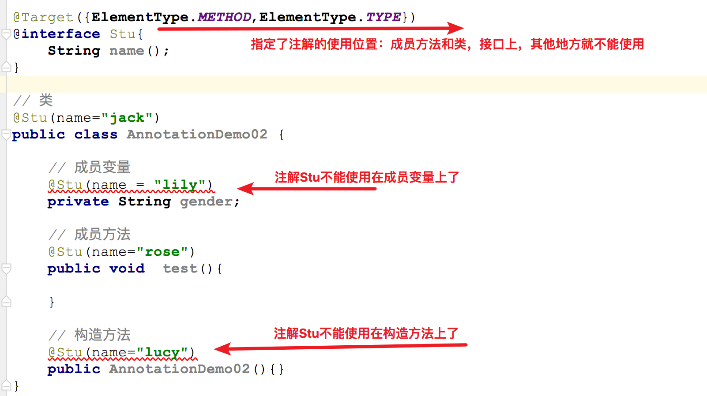


## 3.5 注解解析(难点)

### 3.4.1 什么是注解解析

​	通过Java技术获取注解数据的过程则称为注解解析。

### 3.4.2 与注解解析相关的接口

- **Anontation**：所有注解类型的公共接口，类似所有类的父类是Object。

- **AnnotatedElement**：定义了与注解解析相关的方法，常用方法以下四个：

  ```java
  boolean isAnnotationPresent(Class annotationClass); 判断当前对象是否有指定的注解，有则返回true，否则返回false。
  
  T getAnnotation(Class<T> annotationClass);  获得当前对象上指定的注解对象。
  
  Annotation[] getAnnotations(); 获得当前对象及其从父类上继承的所有的注解对象。
  Annotation[] getDeclaredAnnotations();获得当前对象上所有的注解对象，不包括父类的。
  ```

### 3.4.3 获取注解数据的原理

​	注解作用在那个成员上，就通过反射获得该成员的对象来得到它的注解。
* **如注解作用在方法上，就通过方法(Method)对象得到它的注解**
  ```java
   // 得到方法对象
   Method method = clazz.getDeclaredMethod("方法名"); 
   // 根据注解名得到方法上的注解对象
   Book book = method.getAnnotation(Book.class);  
  ```

- **如注解作用在类上，就通过Class对象得到它的注解**

  ```java
  // 获得Class对象
  Class c = 类名.class;
  // 根据注解的Class获得使用在类上的注解对象
  Book book = c.getAnnotation(Book.class);
  ```

### 3.4.4 使用反射获取注解的数据

#### 3.4.4.1 需求说明

1. 定义注解Book，要求如下：
   - 包含属性：String value()   书名
   - 包含属性：double price()  价格，默认值为 100
   - 包含属性：String[] authors() 多位作者  
   - 限制注解使用的位置：类和成员方法上
   - 指定注解的有效范围：RUNTIME
2. 定义BookStore类，在类和成员方法上使用Book注解
3. 定义TestAnnotation测试类获取Book注解上的数据

#### 3.4.4.2 代码实现 

1. **注解Book**

```java
@Target({ElementType.METHOD,ElementType.TYPE})
@Retention(RetentionPolicy.RUNTIME)
public @interface Book {
        // 书名
        String value();
        // 价格
        double price() default 100;
        // 作者
        String[] authors();
}
```

1. **BookStore类**

```java
@Book(value = "红楼梦",authors = "曹雪芹",,price = 998)
public class BookStore {

    @Book(value = "西游记",authors = "吴承恩")
    public void buyBook(){

    }
}
```

1. **TestAnnotation类**

```java
/**
 * @author pkxing
 * @version 1.0
 * @description com.itheima.annotation
 * @date 2018/1/26
 */
public class TestAnnotation {
    public static void main(String[] args)  throws Exception{
        System.out.println("---------获取类上注解的数据----------");
        test01();
        System.out.println("---------获取成员方法上注解的数据----------");
        test02();
    }

    /**
     * 获取BookStore类上使用的Book注解数据
     */
    public static void test01(){
        // 获得BookStore类对应的Class对象
        Class c = BookStore.class;
        // 根据注解Class对象获取注解对象
        Book book = (Book) c.getAnnotation(Book.class);
        // 输出book注解属性值
        System.out.println("书名：" + book.value());
        System.out.println("价格：" + book.price());
        System.out.println("作者：" + Arrays.toString(book.authors()));
    }

    /**
     * 获取BookStore类成员方法buyBook使用的Book注解数据
     */
    public static void test02() throws Exception{
        // 获得BookStore类对应的Class对象
        Class c = BookStore.class;
        // 获得成员方法buyBook对应的Method对象
        Method m = c.getMethod("buyBook");
        // 根据注解Class对象获取注解对象
        Book book = (Book) m.getAnnotation(Book.class);
        // 输出book注解属性值
        System.out.println("书名：" + book.value());
        System.out.println("价格：" + book.price());
        System.out.println("作者：" + Arrays.toString(book.authors()));
    }
}
```

- 输入结果：


#### 3.4.4.3 存在问题分析

- **TestAnnotation类在获取注解数据时处理得不够严谨，假如出现下面的其中一种情况：**

  1. 把BookStore类或成员方法buyBook上的注解删除。
  2. 将Book注解的有效范围改为：**CLASS**。

  **再运行TestAnnotation类代码则会出现空指针异常，如下图所示：**

  

- **原因分析如下图**

  

  或

  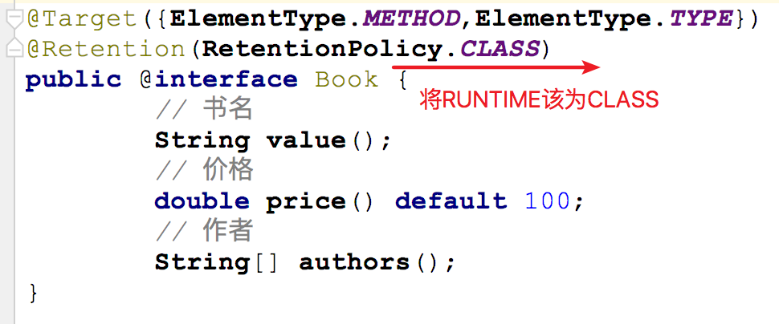

  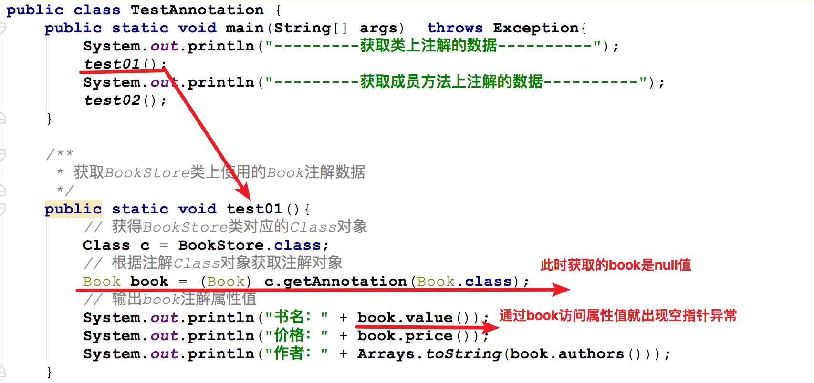   

- **解决方案**

  -  在获取注解对象时，先判断是否有使用注解，如果有，才获取，否则就不用获取。
  -  修改TestAnnotation类的代码，修改后如下

  ```java
  public class TestAnnotation {
      public static void main(String[] args)  throws Exception{
          System.out.println("---------获取类上注解的数据----------");
          test01();
          System.out.println("---------获取成员方法上注解的数据----------");
          test02();
      }

      /**
       * 获取BookStore类上使用的Book注解数据
       */
      public static void test01(){
          // 获得BookStore类对应的Class对象
          Class c = BookStore.class;
          // 判断BookStore类是否使用了Book注解
          if(c.isAnnotationPresent(Book.class)) {
              // 根据注解Class对象获取注解对象
              Book book = (Book) c.getAnnotation(Book.class);
              // 输出book注解属性值
              System.out.println("书名：" + book.value());
              System.out.println("价格：" + book.price());
              System.out.println("作者：" + Arrays.toString(book.authors()));
          }
      }

      /**
       * 获取BookStore类成员方法buyBook使用的Book注解数据
       */
      public static void test02() throws Exception{
          // 获得BookStore类对应的Class对象
          Class c = BookStore.class;
          // 获得成员方法buyBook对应的Method对象
          Method m = c.getMethod("buyBook");
          // 判断成员方法buyBook上是否使用了Book注解
          if(m.isAnnotationPresent(Book.class)) {
              // 根据注解Class对象获取注解对象
              Book book = (Book) m.getAnnotation(Book.class);
              // 输出book注解属性值
              System.out.println("书名：" + book.value());
              System.out.println("价格：" + book.price());
              System.out.println("作者：" + Arrays.toString(book.authors()));
          }
      }
  }
  ```

## 3.6 注解案例

### 3.5.1 案例说明

​	模拟Junit测试的@Test

### 3.5.2 案例分析

1. 模拟Junit测试的注释@Test，首先需要编写自定义注解@MyTest，并添加元注解，保证自定义注解只能修饰方法，且在运行时可以获得。
2. 然后编写目标类（测试类），然后给目标方法（测试方法）使用 @MyTest注解，编写三个方法，其中两个加上@MyTest注解。
3. 最后编写调用类，使用main方法调用目标类，模拟Junit的运行，只要有@MyTest注释的方法都会运行。

### 3.5.3 案例代码

1. **注解MyTest**

```java
@Target(ElementType.METHOD)
@Retention(RetentionPolicy.RUNTIME)
public @interface MyTest {
}
```

1. **目标类MyTestDemo**

```Java
public class MyTestDemo {
    @MyTest
    public  void  test01(){
        System.out.println("test01");
    }

    public  void  test02(){
        System.out.println("test02");
    }

    @MyTest
    public  void  test03(){
        System.out.println("test03");
    }
}
```

1. **调用类TestMyTest**

```java
public class TestMyTest {
    public static void main(String[] args) throws  Exception{
        // 获得MyTestDemo类Class对象
        Class c = MyTestDemo.class;
        // 获得所有的成员方法对象
        Method[] methods = c.getMethods();
        // 创建MyTestDemo类对象
        Object obj = c.newInstance();
        // 遍历数组
        for (Method m:methods) {
            // 判断方法m上是否使用注解MyTest
            if(m.isAnnotationPresent(MyTest.class)){
                // 执行方法m
                m.invoke(obj);
            }
        }
    }
}
```

- 输出结果：

